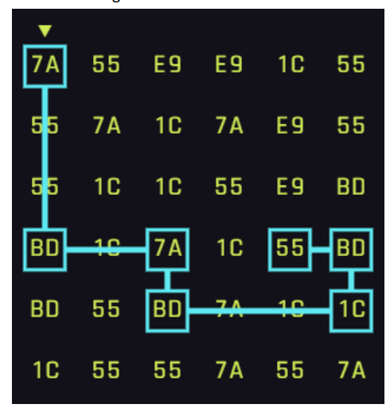
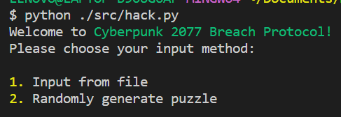

# Solving Cyberpunk 2077 Breach Protocol Using Brute Force

## Program Description
This is a simple brute-force program written in Python to solve the Cyberpunk 2077 minigame Breach Protocol using Python. The program will do an exhaustive search to find the path that passes through as many sequences as possible and gain the maximum amount of points.

## Requirements
This program requires Python installed in your OS to run. Furthermore, it requires the Python library `termcolor` to also be installed. You can simply install this library using the command  `pip install termcolor`.

## Running the Program
To run the program, simply open the root folder in your terminal of choice, and run `python ./src/hack.py` or `python3 ./src/hack.py`.

## Using the Program

The program can solve the puzzle in two modes:

1. File Input Mode
2. Random Matrix Mode

When running, the program will provide instructions on how to procede in solving the puzzle. For File Input Mode, the program will ask for file input. The format of the file can be seen in one of the test files in the `test` folder.

## About Me
I am simply a stressed out CS student that is losing sleep doing college and submitting this project 10 minutes before deadline.
